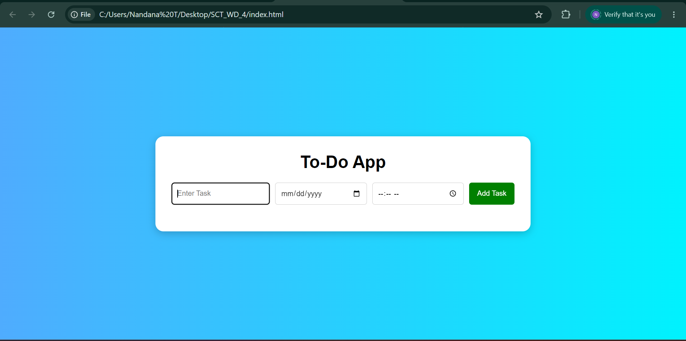
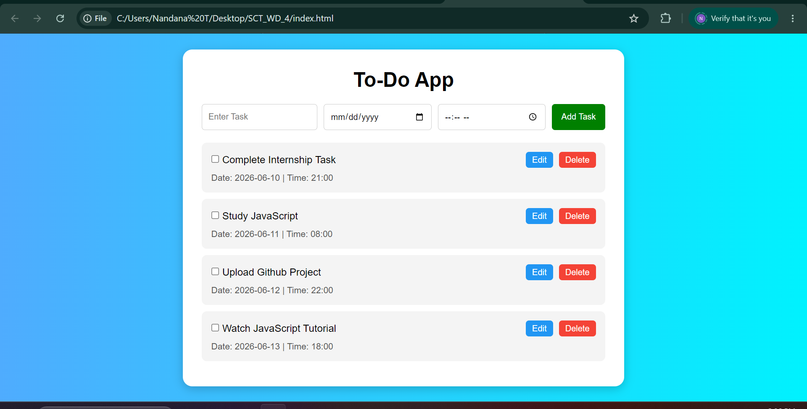
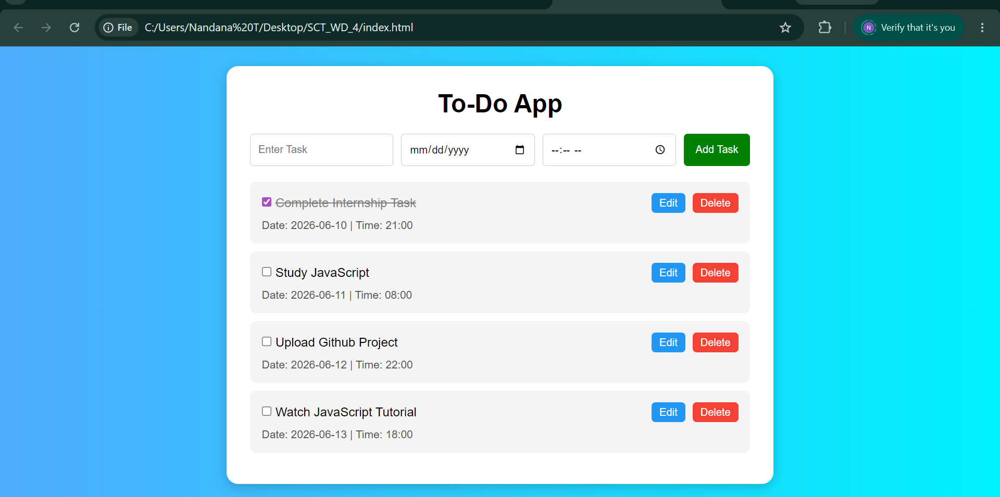
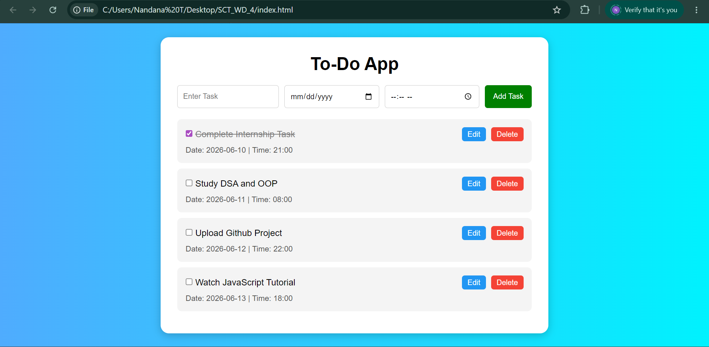
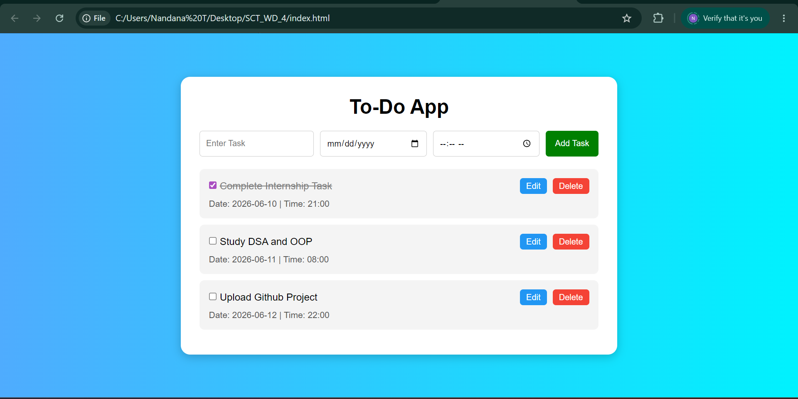

# SCT_WD_4 - To-Do Web Application

## Description
A simple and interactive To-Do Web Application built using HTML, CSS, and JavaScript.

Users can:
- Add tasks
- Set date and time
- Mark tasks as completed
- Edit tasks
- Delete tasks
- Organize and manage daily activities

## Features
- Add new tasks
- Set task date
- Set task time
- Mark tasks as completed
- Edit existing tasks
- Delete tasks
- Responsive user interface

## Technologies Used
- HTML5
- CSS3
- JavaScript

## Screenshots

### Home Page

### Task Added

### Task Completed

### Task Edited

### Final Task List

## Author
Nandana T

SkillCraft Technology Web Development Internship
